# ClaudeControl Architecture Diagram

```mermaid
graph TD
    subgraph "Entry Points"
        CLI[cli.py<br/>Command-line interface]
        MENU[interactive_menu.py<br/>Interactive menu system]
        API[Python API<br/>Direct imports]
    end
    
    subgraph "Core Engine"
        SESSION[Session/core.py<br/>Process control & management]
        REGISTRY[Global Registry<br/>Session persistence]
        CONFIG[Config Loader<br/>~/.claude-control/config.json]
        TRANSPORT[Transport Layer<br/>Live/Replay abstraction]
    end
    
    subgraph "Investigation Framework"
        INVESTIGATOR[investigate.py/ProgramInvestigator<br/>Automatic program exploration]
        REPORT[InvestigationReport<br/>Findings documentation]
        STATE[ProgramState<br/>State mapping]
    end
    
    subgraph "Testing Framework"
        BLACKBOX[testing.py/BlackBoxTester<br/>Comprehensive CLI testing]
        TESTRUNNER[Test Suites<br/>Startup/Help/Fuzz/Resource tests]
    end
    
    subgraph "Helper Functions"
        HELPERS[claude_helpers.py<br/>High-level convenience functions]
        CMDCHAIN[CommandChain<br/>Sequential command execution]
        PARALLEL[parallel_commands<br/>Concurrent execution]
        MONITOR[watch_process<br/>Process monitoring]
    end
    
    subgraph "Record & Replay System"
        RECORDER[replay/record.py<br/>Session recording]
        PLAYER[replay/play.py<br/>Tape playback]
        TAPESTORE[replay/store.py<br/>Tape management]
        MATCHERS[replay/matchers.py<br/>Dynamic value matching]
        NORMALIZERS[replay/normalize.py<br/>Text normalization]
        DECORATORS[replay/decorators.py<br/>Data transformation]
        REDACT[replay/redact.py<br/>Secret removal]
    end

    subgraph "Pattern Matching"
        PATTERNS[patterns.py<br/>Text extraction & classification]
        PROMPTS[COMMON_PROMPTS<br/>Prompt detection patterns]
        ERRORS[COMMON_ERRORS<br/>Error detection patterns]
        FORMATS[Data Format Detection<br/>JSON/XML/CSV/Table]
    end
    
    subgraph "Low-Level Infrastructure"
        PEXPECT[pexpect<br/>Process spawning & control]
        EXCEPTIONS[exceptions.py<br/>Custom error types]
        PSUTIL[psutil<br/>Process management]
    end
    
    subgraph "Data Storage"
        SESSIONS[(~/.claude-control/sessions/<br/>Session logs & state)]
        CONFIGS[(~/.claude-control/programs/<br/>Saved configurations)]
        INVESTIGATIONS[(~/.claude-control/investigations/<br/>Investigation reports)]
        TAPES[(./tapes/<br/>Recorded session tapes)]
        PIPES[(/tmp/claudecontrol/*.pipe<br/>Named pipes for streaming)]
    end
    
    subgraph "External Processes"
        TARGET[Target CLI Program<br/>Program being controlled]
        SSH[SSH Sessions<br/>Remote programs]
    end

    %% Entry point connections
    CLI -->|creates| SESSION
    CLI -->|calls| HELPERS
    CLI -->|initiates| INVESTIGATOR
    CLI -->|runs| BLACKBOX
    MENU -->|orchestrates| CLI
    API -->|direct access| SESSION
    API -->|direct access| HELPERS
    API -->|direct access| INVESTIGATOR
    API -->|direct access| BLACKBOX

    %% Core engine flow
    SESSION -->|uses| TRANSPORT
    TRANSPORT -->|live mode| PEXPECT
    TRANSPORT -->|replay mode| PLAYER
    SESSION -->|registers| REGISTRY
    SESSION -->|loads| CONFIG
    SESSION -->|writes logs| SESSIONS
    SESSION -->|creates pipes| PIPES
    SESSION -->|controls via| TARGET
    REGISTRY -->|persists| SESSIONS
    CONFIG -->|configures| SESSION
    CONFIG -->|replay settings| TAPESTORE

    %% Investigation flow
    INVESTIGATOR -->|uses| SESSION
    INVESTIGATOR -->|analyzes with| PATTERNS
    INVESTIGATOR -->|creates| STATE
    INVESTIGATOR -->|generates| REPORT
    INVESTIGATOR -->|probes| TARGET
    REPORT -->|saves to| INVESTIGATIONS
    STATE -->|tracks transitions| TARGET

    %% Testing flow
    BLACKBOX -->|creates| SESSION
    BLACKBOX -->|tests| TARGET
    BLACKBOX -->|uses| PATTERNS
    BLACKBOX -->|monitors with| PSUTIL
    TESTRUNNER -->|executes in| BLACKBOX

    %% Helper interactions
    HELPERS -->|wraps| SESSION
    HELPERS -->|uses| PATTERNS
    HELPERS -->|implements| CMDCHAIN
    HELPERS -->|implements| PARALLEL
    HELPERS -->|implements| MONITOR
    CMDCHAIN -->|sequential| SESSION
    PARALLEL -->|concurrent| SESSION
    MONITOR -->|watches| SESSION
    HELPERS -->|ssh via| SSH

    %% Pattern matching flow
    PATTERNS -->|detects prompts| PROMPTS
    PATTERNS -->|detects errors| ERRORS
    PATTERNS -->|classifies| FORMATS
    SESSION -->|uses patterns| PATTERNS
    INVESTIGATOR -->|uses patterns| PATTERNS
    BLACKBOX -->|uses patterns| PATTERNS

    %% Record & Replay flow
    SESSION -->|records with| RECORDER
    RECORDER -->|captures via| PEXPECT
    RECORDER -->|normalizes with| NORMALIZERS
    RECORDER -->|redacts with| REDACT
    RECORDER -->|decorates with| DECORATORS
    RECORDER -->|saves to| TAPES
    PLAYER -->|loads from| TAPESTORE
    PLAYER -->|matches with| MATCHERS
    TAPESTORE -->|indexes| TAPES
    TAPESTORE -->|validates| TAPES

    %% Infrastructure
    PEXPECT -->|spawns| TARGET
    PEXPECT -->|connects| SSH
    SESSION -->|throws| EXCEPTIONS
    BLACKBOX -->|uses| PSUTIL
    PSUTIL -->|monitors| TARGET

    %% Data persistence
    SESSION -->|saves config| CONFIGS
    SESSION -->|loads config| CONFIGS
    PIPES -->|streams from| TARGET
    RECORDER -->|persists tapes| TAPES
    PLAYER -->|reads tapes| TAPES

    %% Styling
    classDef entryPoint fill:#e1f5fe,stroke:#01579b,stroke-width:2px
    classDef core fill:#fff3e0,stroke:#e65100,stroke-width:2px
    classDef framework fill:#f3e5f5,stroke:#4a148c,stroke-width:2px
    classDef helper fill:#e8f5e9,stroke:#1b5e20,stroke-width:2px
    classDef replay fill:#e3f2fd,stroke:#0d47a1,stroke-width:2px
    classDef pattern fill:#fce4ec,stroke:#880e4f,stroke-width:2px
    classDef infra fill:#f5f5f5,stroke:#424242,stroke-width:2px
    classDef storage fill:#fff8e1,stroke:#f57f17,stroke-width:2px
    classDef external fill:#e0f2f1,stroke:#004d40,stroke-width:2px

    class CLI,MENU,API entryPoint
    class SESSION,REGISTRY,CONFIG,TRANSPORT core
    class INVESTIGATOR,REPORT,STATE,BLACKBOX,TESTRUNNER framework
    class HELPERS,CMDCHAIN,PARALLEL,MONITOR helper
    class RECORDER,PLAYER,TAPESTORE,MATCHERS,NORMALIZERS,DECORATORS,REDACT replay
    class PATTERNS,PROMPTS,ERRORS,FORMATS pattern
    class PEXPECT,EXCEPTIONS,PSUTIL infra
    class SESSIONS,CONFIGS,INVESTIGATIONS,TAPES,PIPES storage
    class TARGET,SSH external
```

## Component Descriptions

### Entry Points
- **cli.py**: Command-line interface with subcommands:
  - Core: `run`, `investigate`, `probe`, `test`, `fuzz`
  - Record/Replay: `rec`, `play`, `proxy`
  - Management: `tapes list/validate/redact`, `config`, `status`
- **interactive_menu.py**: User-friendly menu-driven interface for guided interaction
- **Python API**: Direct import and use of modules in Python scripts

### Core Engine
- **Session (core.py)**: Main class managing process lifecycle, I/O, and state
- **Global Registry**: In-memory session storage for persistence across calls
- **Config Loader**: Loads settings from ~/.claude-control/config.json including replay configuration
- **Transport Layer**: Abstraction that routes to live process (pexpect) or tape replay based on mode

### Investigation Framework
- **ProgramInvestigator**: Automatically explores CLI programs to discover commands and behavior
- **InvestigationReport**: Structured findings including commands, states, prompts, and patterns
- **ProgramState**: Tracks different program states and transitions between them

### Testing Framework
- **BlackBoxTester**: Comprehensive testing without source code access
- **Test Suites**: Startup, help system, invalid input, exit behavior, resources, concurrency, fuzzing

### Helper Functions
- **claude_helpers.py**: High-level functions like test_command, probe_interface, investigation_summary
- **CommandChain**: Sequential command execution with conditions
- **parallel_commands**: Run multiple commands concurrently
- **watch_process**: Monitor processes for specific patterns

### Record & Replay System
- **Recorder (replay/record.py)**: Captures session I/O to tapes using pexpect's logfile_read hook
- **Player (replay/play.py)**: Replays recorded tapes instead of running actual programs
- **TapeStore (replay/store.py)**: Manages tape loading, indexing, and validation
- **Matchers (replay/matchers.py)**: Custom matching logic for dynamic values (timestamps, IDs)
- **Normalizers (replay/normalize.py)**: Text normalization (ANSI stripping, whitespace collapse)
- **Decorators (replay/decorators.py)**: Transform data during record/replay
- **Redact (replay/redact.py)**: Automatic secret removal from recordings

### Pattern Matching
- **patterns.py**: Core pattern detection and text extraction
- **COMMON_PROMPTS**: Pre-defined patterns for various shell prompts
- **COMMON_ERRORS**: Pre-defined error message patterns
- **Data Format Detection**: Identifies JSON, XML, CSV, tables in output

### Infrastructure
- **pexpect**: External library for process spawning and PTY control
- **exceptions.py**: Custom exceptions (SessionError, TimeoutError, ProcessError)
- **psutil**: External library for process monitoring and management

### Data Flow
1. **Discovery Flow**: CLI/API → ProgramInvestigator → Session → Target Program → Patterns → Report
2. **Testing Flow**: CLI/API → BlackBoxTester → Multiple Sessions → Target Program → Test Results
3. **Automation Flow**: CLI/API → Helpers/Session → Target Program → Output/State
4. **Recording Flow**: Session → Recorder → pexpect hooks → Normalizers/Redact → Tapes
5. **Replay Flow**: Session → Player → TapeStore → Matchers → Simulated Output
6. **Persistence Flow**: Session ↔ Registry ↔ File System (logs, configs, reports, tapes)

### Key Interactions
- Sessions can be reused via the Global Registry
- All high-level operations go through Session class
- Pattern matching is used by all major components
- Named pipes enable real-time streaming
- Configuration affects all session creation
- Transport layer transparently switches between live and replay modes
- Recorder hooks into pexpect's logfile_read for non-intrusive capture
- TapeStore loads all tapes at startup (no hot-reload)

### Tape Lifecycle
1. **Recording Phase**:
   - Session creates Recorder when `record=RecordMode.NEW/OVERWRITE`
   - Recorder attaches ChunkSink to pexpect's logfile_read
   - Each send/sendline starts a new exchange
   - Output chunks captured with timestamps
   - Normalizers and redactors process data
   - Exchange saved to tape file on completion

2. **Storage Phase**:
   - Tapes stored as JSON5 files in `./tapes/{program}/`
   - Human-editable format with comments support
   - Base64 encoding for binary data
   - Metadata includes environment, args, timestamps

3. **Replay Phase**:
   - TapeStore loads and indexes all tapes at startup
   - Player matches input against tape exchanges
   - Matchers handle dynamic values (timestamps, IDs)
   - Output streamed with original timing (or custom latency)
   - Error injection for testing error handling

4. **Tape Management**:
   - CLI commands for listing, validating, redacting tapes
   - Exit summaries show new and unused tapes
   - Decorators allow runtime tape transformation

### Recording & Replay Modes

#### Recording Modes
- **NEW**: Record only if no existing tape matches the session
- **OVERWRITE**: Always record, replacing existing tapes
- **DISABLED**: Never record (replay-only mode)

#### Fallback Modes (when tape not found)
- **NOT_FOUND**: Raise TapeMissError - fails fast in CI/CD
- **PROXY**: Run the real program and optionally record

#### Mode Combinations
| Record Mode | Fallback Mode | Behavior |
|------------|---------------|----------|
| NEW | PROXY | Record new sessions, run live if no tape |
| NEW | NOT_FOUND | Record new sessions, fail if no tape |
| OVERWRITE | PROXY | Always re-record, run live if needed |
| DISABLED | NOT_FOUND | Pure replay, fail if no tape (CI/CD) |
| DISABLED | PROXY | Try replay first, fall back to live |