# ClaudeControl Data Flow Diagram

## Main Data Flow Architecture

```mermaid
graph TD
    subgraph "Input Sources"
        USER_CMD[/User Commands<br/>CLI Args/]
        USER_INPUT[/Interactive Input<br/>stdin/]
        CONFIG_FILE[/Config Files<br/>JSON/]
        TARGET_PROG[/Target Program<br/>Process Output/]
    end
    
    subgraph "Entry Points & Routing"
        CLI[CLI Parser<br/>argparse]
        MENU[Interactive Menu<br/>User Selection]
        API[Python API<br/>Direct Import]
        
        ROUTER{Route to<br/>Operation}
    end
    
    subgraph "Core Operations"
        subgraph "Discovery Flow"
            INVESTIGATE[Program<br/>Investigator]
            PROBE[Quick Probe<br/>Interface Check]
            STATE_MAP[State Mapper<br/>FSM Discovery]
            FUZZ[Fuzzer<br/>Input Generator]
        end
        
        subgraph "Testing Flow"
            BLACKBOX[Black Box<br/>Tester]
            TEST_SUITE[Test Suite<br/>Runner]
            RESOURCE_MON[Resource<br/>Monitor]
        end
        
        subgraph "Automation Flow"
            SESSION[Session<br/>Controller]
            CHAIN[Command<br/>Chain]
            PARALLEL[Parallel<br/>Executor]
        end
    end
    
    subgraph "Processing Pipeline"
        SPAWN[Process<br/>Spawner<br/>pexpect]
        PATTERN_MATCH{Pattern<br/>Matcher}
        OUTPUT_BUFFER[Output<br/>Buffer<br/>10K lines]
        CLASSIFIER[Output<br/>Classifier]
    end
    
    subgraph "Data Storage"
        REGISTRY[(Session<br/>Registry<br/>In-Memory)]
        SESSION_LOG[(Session Logs<br/>~/.claude-control/<br/>sessions/)]
        INVESTIGATION_DB[(Investigation<br/>Reports<br/>JSON)]
        TEST_REPORTS[(Test Reports<br/>JSON)]
        PROG_CONFIGS[(Program<br/>Configs<br/>JSON)]
        NAMED_PIPE[(Named Pipes<br/>/tmp/claudecontrol/)]
    end
    
    subgraph "Output Destinations"
        CONSOLE[/Console Output<br/>stdout/]
        REPORT_FILE[/Report Files<br/>JSON/Markdown/]
        PIPE_STREAM[/Stream Output<br/>Named Pipe/]
        CALLBACK[/User Callbacks<br/>Python Functions/]
    end
    
    %% Input Flow
    USER_CMD -->|CLI args| CLI
    USER_INPUT -->|stdin| MENU
    USER_CMD -->|import| API
    CONFIG_FILE -->|JSON config| SESSION
    
    CLI --> ROUTER
    MENU --> ROUTER
    API --> ROUTER
    
    %% Route to Operations
    ROUTER -->|investigate cmd| INVESTIGATE
    ROUTER -->|test cmd| BLACKBOX
    ROUTER -->|run/control cmd| SESSION
    ROUTER -->|probe cmd| PROBE
    ROUTER -->|chain cmd| CHAIN
    
    %invaded Discovery Flow
    INVESTIGATE -->|spawn| SPAWN
    PROBE -->|spawn| SPAWN
    STATE_MAP -->|spawn| SPAWN
    FUZZ -->|random inputs| SPAWN
    
    SPAWN -->|PTY output| OUTPUT_BUFFER
    TARGET_PROG -->|stdout/stderr| OUTPUT_BUFFER
    
    OUTPUT_BUFFER -->|text lines| PATTERN_MATCH
    PATTERN_MATCH -->|matches| CLASSIFIER
    
    CLASSIFIER -->|prompts| INVESTIGATE
    CLASSIFIER -->|errors| INVESTIGATE
    CLASSIFIER -->|JSON/XML| INVESTIGATE
    CLASSIFIER -->|state change| STATE_MAP
    
    INVESTIGATE -->|report JSON| INVESTIGATION_DB
    STATE_MAP -->|state graph| INVESTIGATION_DB
    
    %% Testing Flow
    BLACKBOX -->|test commands| TEST_SUITE
    TEST_SUITE -->|spawn multiple| SPAWN
    TEST_SUITE -->|monitor| RESOURCE_MON
    RESOURCE_MON -->|psutil data| TEST_SUITE
    
    TEST_SUITE -->|results| TEST_REPORTS
    BLACKBOX -->|summary| REPORT_FILE
    
    %% Automation Flow
    SESSION -->|spawn| SPAWN
    SESSION -->|register| REGISTRY
    SESSION -->|logs| SESSION_LOG
    SESSION -->|stream| NAMED_PIPE
    
    CHAIN -->|sequential| SESSION
    PARALLEL -->|concurrent| SESSION
    
    REGISTRY -->|reuse session| SESSION
    SESSION_LOG -->|rotation at 10MB| SESSION_LOG
    
    %% Output Flow
    SESSION -->|get_output| CONSOLE
    INVESTIGATE -->|summary| CONSOLE
    BLACKBOX -->|report| CONSOLE
    
    NAMED_PIPE -->|real-time| PIPE_STREAM
    SESSION -->|watch events| CALLBACK
    
    %% Data persistence
    INVESTIGATION_DB -->|load| INVESTIGATE
    PROG_CONFIGS -->|load| SESSION
    TEST_REPORTS -->|load| BLACKBOX
```

## Detailed Data Flow Patterns

### 1. Discovery Data Flow

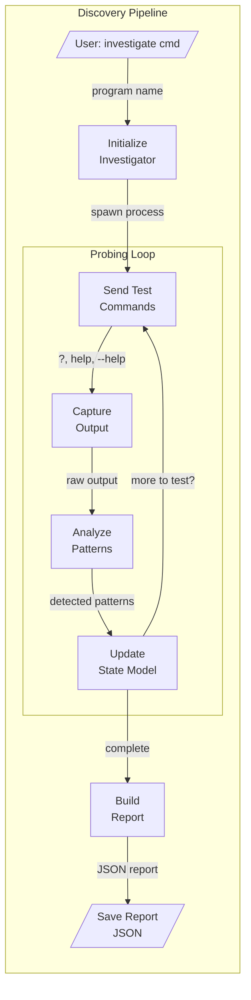

### 2. Testing Data Flow

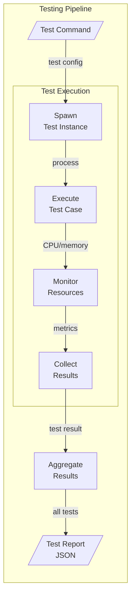

### 3. Automation Data Flow

```mermaid
graph LR
    subgraph "Automation Pipeline"
        CMD[/User Script/]
        GET_SESSION[Get/Create<br/>Session]

        subgraph "Interaction Loop"
            SEND[Send Input]
            EXPECT[Wait for<br/>Pattern]
            MATCH{Pattern<br/>Match?}
            TIMEOUT{Timeout?}
        end

        OUTPUT[/Return Output/]
        ERROR[/Raise Exception/]
    end

    CMD -->|control()| GET_SESSION
    GET_SESSION -->|session| SEND
    SEND -->|text to stdin| EXPECT
    EXPECT --> MATCH
    MATCH -->|yes| OUTPUT
    MATCH -->|no| TIMEOUT
    TIMEOUT -->|no| EXPECT
    TIMEOUT -->|yes| ERROR
```

### 4. Record & Replay Data Flow

```mermaid
graph TD
    subgraph "Recording Pipeline"
        REC_START[/rec command/]
        INIT_REC[Initialize<br/>Recorder]
        ATTACH_SINK[Attach<br/>ChunkSink<br/>to logfile_read]

        subgraph "Exchange Loop"
            CAPTURE_IN[Capture<br/>Input]
            CAPTURE_OUT[Capture<br/>Output Chunks<br/>with Timing]
            SEGMENT[Segment<br/>Exchange]
            NORMALIZE[Normalize<br/>Text]
            REDACT[Redact<br/>Secrets]
        end

        WRITE_TAPE[Write<br/>Tape JSON5]
        MARK_NEW[Mark as<br/>New Tape]
    end

    REC_START -->|Session init| INIT_REC
    INIT_REC -->|pexpect hook| ATTACH_SINK
    ATTACH_SINK -->|on send| CAPTURE_IN
    CAPTURE_IN -->|bytes stream| CAPTURE_OUT
    CAPTURE_OUT -->|prompt match| SEGMENT
    SEGMENT -->|process text| NORMALIZE
    NORMALIZE -->|security| REDACT
    REDACT -->|atomic write| WRITE_TAPE
    WRITE_TAPE -->|tracking| MARK_NEW
```

### 5. Replay Data Flow

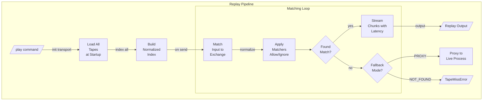

## Data Transformations

### Input Transformations
| Stage | Input Format | Output Format | Transformation |
|-------|--------------|---------------|----------------|
| CLI Parsing | Raw argv | Parsed args dict | argparse validation |
| Config Loading | JSON/JSON5 files | Python dict | JSON5 deserialization + defaults |
| Pattern Compilation | String patterns | Regex objects | re.compile() |
| Command Template | Template string | Formatted command | String interpolation |
| Tape Loading | JSON5 tapes | Tape objects | pyjson5 parse + validation |
| Input Matching | Raw input bytes | Normalized key | Strip ANSI/whitespace + hash |

### Output Transformations
| Stage | Input Format | Output Format | Transformation |
|-------|--------------|---------------|----------------|
| Output Buffering | Byte stream | UTF-8 strings | Decode + line splitting |
| Pattern Extraction | Raw text | Structured data | Regex groups extraction |
| JSON Detection | Mixed text | JSON objects | JSON parsing |
| State Detection | Output + patterns | State name | FSM transition logic |
| Report Generation | Raw findings | Markdown/JSON | Template rendering |
| Chunk Recording | Raw bytes | Base64 chunks | Encode + timestamp delta |
| Secret Redaction | Text with secrets | Sanitized text | Pattern match + replace |
| ANSI Normalization | Terminal output | Plain text | Escape sequence removal |

### Data Aggregations
| Operation | Input Data | Output Data | Aggregation Method |
|-----------|------------|-------------|-------------------|
| Investigation | Multiple probes | Single report | Merge findings + dedupe |
| Testing | Individual tests | Test suite results | Group by test type |
| Parallel Commands | Multiple outputs | Results dict | Keyed by command |
| Resource Monitoring | Time series data | Statistics | Min/max/avg calculation |
| Tape Indexing | All tape exchanges | Hash map index | Normalized key extraction |
| Exit Summary | Session tape usage | New/unused lists | Set operations on paths |

## Data Volume & Performance

### Typical Data Sizes
- **Session Output Buffer**: 10,000 lines (configurable)
- **Log File Rotation**: 10MB per file
- **Investigation Reports**: 5-50KB JSON
- **Test Reports**: 10-100KB JSON
- **Named Pipe Buffer**: 64KB (OS default)
- **Pattern Cache**: ~100 compiled patterns
- **Tape Files**: 1-100KB JSON5 per session
- **Tape Index**: ~1KB per 100 exchanges
- **Chunk Size**: 10-1000 bytes per chunk

### Processing Times
- **Session Spawn**: 10-100ms
- **Pattern Matching**: <1ms per line
- **Investigation**: 5-60 seconds (depends on program)
- **Black Box Testing**: 10-120 seconds
- **Parallel Commands**: Limited by slowest command
- **Tape Index Build**: ≤200ms per 1000 exchanges
- **Exchange Matching**: ≤2ms with hash lookup
- **Chunk Streaming**: ≤50ms jitter with latency

### Bottlenecks
1. **Process Spawning**: PTY allocation can be slow
2. **Pattern Matching**: Complex regex on large outputs
3. **File I/O**: Log rotation during heavy output
4. **Named Pipes**: Reader must keep up with writer
5. **Tape Loading**: All tapes load at startup (no hot reload)
6. **Normalization**: ANSI stripping on large outputs

## Data Consistency

### Transaction Boundaries
- **Session Operations**: Each expect/send is atomic
- **Investigation**: Complete report or rollback
- **Testing**: Each test case is independent
- **Config Save**: Atomic file write with temp file
- **Tape Write**: Atomic via temp file + rename
- **Exchange Recording**: Complete exchange or discard

### Eventual Consistency Points
- **Session Registry**: In-memory, lost on crash
- **Log Files**: Buffered writes, may lose last lines
- **Named Pipes**: No persistence, real-time only
- **Tape Index**: Loaded once, edits require restart

### Data Synchronization
- **Registry Lock**: Thread-safe session access
- **File Locks**: Prevent concurrent config writes
- **Process Groups**: Ensure child cleanup
- **Tape Store Lock**: RW lock for index access
- **Chunk Sink**: Single-threaded via logfile_read hook

## Error Handling Data Flows

### Failed Pattern Match
```
Expect Pattern → Timeout → Capture Recent Output → TimeoutError(output)
```

### Process Death
```
Send Command → SIGCHLD → Check Exit Status → ProcessError(exitcode)
```

### Resource Exhaustion
```
Monitor Resources → Threshold Exceeded → Kill Process → ResourceError
```

### Recovery Mechanisms
- **Session Retry**: Respawn dead sessions
- **Pattern Fallback**: Try alternative patterns
- **Timeout Extension**: Adaptive timeout adjustment
- **Output Truncation**: Prevent memory overflow
- **Tape Miss Fallback**: Proxy to live process
- **Recording Fallback**: Continue on write failure

## Tape Data Flow

### Tape Lifecycle
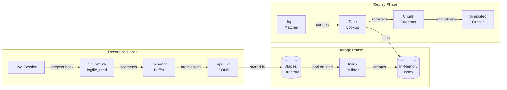

### Tape Format Transformations
```
Raw Bytes → Base64 Encoding → JSON5 Chunks → Tape Exchange → File Storage
                ↓                    ↓              ↓            ↓
            Timestamps          Normalization   Redaction   Compression
```

### Mode Combinations
| Record Mode | Fallback Mode | Tape Exists | Behavior |
|------------|---------------|-------------|----------|
| NEW | PROXY | No | Record new tape, run live |
| NEW | PROXY | Yes | Use existing tape |
| NEW | NOT_FOUND | No | Record new tape, run live |
| NEW | NOT_FOUND | Yes | Use existing tape |
| OVERWRITE | PROXY | Any | Always re-record |
| DISABLED | PROXY | No | Run live, no recording |
| DISABLED | PROXY | Yes | Replay from tape |
| DISABLED | NOT_FOUND | No | Raise TapeMissError |
| DISABLED | NOT_FOUND | Yes | Replay from tape |

## Stream Processing (Named Pipes)

### Real-time Data Flow
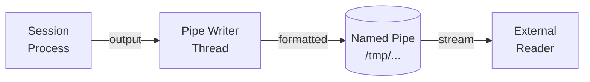

### Pipe Data Format
```
[2024-01-10T10:30:45][OUT] Normal output line
[2024-01-10T10:30:46][ERR] Error output line
[2024-01-10T10:30:47][IN] User input sent
[2024-01-10T10:30:48][MTX] Session metadata
```

## Performance Optimizations

### Caching Strategies
- **Compiled Patterns**: Cache regex compilation
- **Session Reuse**: Keep sessions alive across calls
- **Config Cache**: Load configs once per run
- **Output Windows**: Sliding window buffer
- **Tape Index**: Load all tapes once at startup
- **Normalized Keys**: Cache exchange match keys

### Batch Processing
- **Parallel Execution**: ThreadPoolExecutor for concurrent commands
- **Bulk Pattern Matching**: Match multiple patterns in one pass
- **Deferred Writes**: Batch log writes

### Resource Management
- **Lazy Loading**: Load patterns on demand
- **Stream Processing**: Process output line by line
- **Garbage Collection**: Explicit cleanup of dead sessions
- **Memory Limits**: Configurable buffer sizes

## Security Considerations

### Data Sanitization
- **Command Injection**: Escape shell metacharacters
- **Path Traversal**: Validate file paths
- **Sensitive Data**: Avoid logging passwords
- **Safe Mode**: Block dangerous commands
- **Tape Redaction**: Auto-detect and mask secrets
- **Environment Filtering**: Remove sensitive env vars

### Isolation
- **Process Isolation**: Separate PTY per session
- **File Permissions**: User-only access to logs
- **Network Isolation**: No network access by default
- **Resource Limits**: CPU/memory quotas

## Monitoring & Observability

### Data Collection Points
- Session creation/destruction events
- Pattern match success/failure rates
- Resource usage metrics
- Error frequency and types

### Metrics Flow
```
Session Events → Registry → Status API → Monitoring Tools
Process Metrics → psutil → Resource Monitor → Test Reports
Error Events → Logger → Log Files → Analysis Tools
Tape Usage → Exit Summary → Console Output → CI/CD Reports
Match Statistics → Debug Logs → Performance Analysis
```

## Record & Replay Integration

### Matcher Pipeline
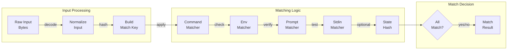

### Decorator Chain
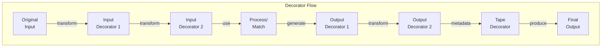

### Transport Abstraction
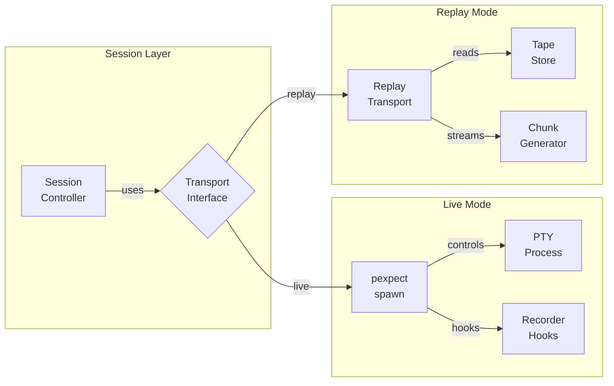

### Error Injection Flow
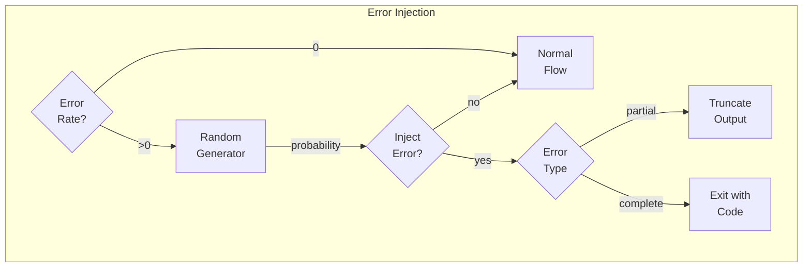

### Exit Summary Generation
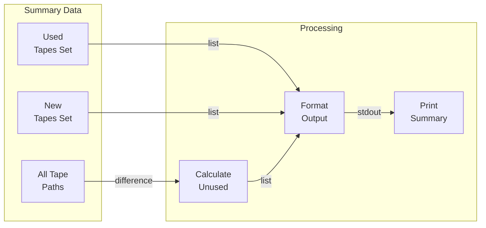