# ClaudeControl Data Models

```mermaid
erDiagram
    SESSION {
        string session_id PK
        string command
        int timeout
        datetime created_at
        datetime last_activity
        bool persist
        string encoding
        int pid
        int exitstatus
        string state "alive|dead|zombie"
        string record_mode "NEW|OVERWRITE|DISABLED"
        string fallback_mode "NOT_FOUND|PROXY"
        string transport_type "live|replay"
        string tape_name FK
    }
    
    PROGRAM_CONFIG {
        string name PK
        string command_template
        int typical_timeout
        json expect_sequences
        json success_indicators
        json ready_indicators
        string notes
        json sample_output
    }
    
    INVESTIGATION_REPORT {
        string id PK
        string program
        datetime started_at
        datetime completed_at
        string entry_state_id FK
        json commands
        json prompts
        json error_messages
        json help_commands
        json exit_commands
        json data_formats
        json safety_notes
    }
    
    PROGRAM_STATE {
        string id PK
        string report_id FK
        string name
        string prompt
        json commands
        json transitions
        json output_samples
        json error_patterns
    }
    
    TEST_RESULT {
        string id PK
        string program
        datetime timestamp
        string test_type "startup|help|invalid_input|exit|resource|concurrent|fuzz"
        bool passed
        json details
        string error
    }
    
    SESSION_OUTPUT {
        string session_id FK
        string log_path
        int output_lines
        int buffer_size
        datetime rotated_at
    }
    
    INTERACTION_LOG {
        string id PK
        string session_id FK
        datetime timestamp
        string action "START|SEND|RECV|EXPECT|ERROR"
        string input_text
        string output_text
        string pattern_matched
    }
    
    NAMED_PIPE {
        string session_id FK
        string pipe_path
        string state "active|closed"
        datetime created_at
    }
    
    COMMAND_CHAIN {
        string id PK
        string name
        json commands
        string cwd
        int timeout
    }
    
    CHAIN_COMMAND {
        string chain_id FK
        int sequence_order
        string command
        string expect_pattern
        string send_text
        json condition
        bool on_success
        bool on_failure
    }
    
    PATTERN_LIBRARY {
        string pattern_type PK "prompt|error|help|data_format|state"
        string category
        json patterns
        string description
    }
    
    GLOBAL_CONFIG {
        string key PK
        json value
        string category "session|investigation|testing|logging|replay"
    }

    TAPE {
        string tape_id PK
        string program
        json args
        json env
        string cwd
        datetime created_at
        string tag
        int latency
        int error_rate
        int seed
        string file_path
        json meta
        json session_info
    }

    EXCHANGE {
        string exchange_id PK
        string tape_id FK
        int sequence_order
        json pre_state
        json input
        json output
        json exit_info
        int duration_ms
        json annotations
    }

    CHUNK {
        string chunk_id PK
        string exchange_id FK
        int sequence_order
        int delay_ms
        string data_b64
        bool is_utf8
    }

    TAPE_INDEX {
        string index_key PK
        string tape_id FK
        int exchange_index
        string normalized_key
        datetime last_accessed
    }

    MATCHER_CONFIG {
        string matcher_id PK
        string session_id FK
        string matcher_type "command|env|prompt|stdin|state"
        json allow_list
        json ignore_list
        string custom_logic
    }

    DECORATOR_CONFIG {
        string decorator_id PK
        string session_id FK
        string decorator_type "input|output|tape"
        string function_name
        json parameters
        int execution_order
    }

    REDACTION_PATTERN {
        string pattern_id PK
        string pattern_regex
        string replacement
        string category "password|token|key|custom"
        bool enabled
    }

    SESSION ||--o{ SESSION_OUTPUT : generates
    SESSION ||--o{ INTERACTION_LOG : records
    SESSION ||--o| NAMED_PIPE : "may create"
    SESSION ||--o| PROGRAM_CONFIG : "may use"
    SESSION ||--o| TAPE : "may record"
    SESSION ||--o| TAPE : "may replay"
    SESSION ||--o{ MATCHER_CONFIG : "configures"
    SESSION ||--o{ DECORATOR_CONFIG : "applies"
    
    INVESTIGATION_REPORT ||--|{ PROGRAM_STATE : contains
    INVESTIGATION_REPORT ||--|| PROGRAM_STATE : "has entry"
    
    COMMAND_CHAIN ||--|{ CHAIN_COMMAND : contains

    TAPE ||--|{ EXCHANGE : contains
    EXCHANGE ||--|{ CHUNK : contains
    TAPE_INDEX }|--|| TAPE : indexes
    TAPE_INDEX }|--|| EXCHANGE : references

    SESSION }o--|| GLOBAL_CONFIG : "configured by"
    INVESTIGATION_REPORT }o--|| GLOBAL_CONFIG : "configured by"
    TAPE }o--|| GLOBAL_CONFIG : "configured by"
```



## Data Structure Details

### Core Entities

#### SESSION
- **Purpose**: Represents an active or historical process control session
- **Persistence**: In-memory with optional file system backing
- **Key Relationships**:
  - Generates output logs
  - Records interaction history
  - May create named pipes for streaming
  - May load from saved configurations
  - May record sessions to tapes
  - May replay from existing tapes
  - Configures matchers and decorators
- **New Fields**:
  - `record_mode`: Controls tape recording behavior
  - `fallback_mode`: Defines behavior when tape is not found
  - `transport_type`: Indicates live process or tape replay
  - `tape_name`: Reference to associated tape

#### PROGRAM_CONFIG
- **Purpose**: Reusable configuration templates for known programs
- **Storage**: `~/.claude-control/programs/{name}.json`
- **Usage**: Sessions can be created from configs for consistent behavior

#### INVESTIGATION_REPORT
- **Purpose**: Complete findings from program investigation
- **Storage**: `~/.claude-control/investigations/{program}_{timestamp}.json`
- **Key Fields**:
  - `commands`: Dict of discovered commands with descriptions
  - `data_formats`: List of detected output formats (JSON, XML, CSV, etc.)
  - `safety_notes`: Warnings about dangerous operations

#### PROGRAM_STATE
- **Purpose**: Represents different states/modes within a program
- **Examples**: Main menu, config mode, data entry mode
- **Transitions**: Maps commands that move between states

#### TAPE
- **Purpose**: Stores recorded CLI session for deterministic replay
- **Storage**: `./tapes/{program}/` as JSON5 files
- **Key Fields**:
  - `meta`: Tape metadata including creation time, environment
  - `session_info`: Recording session information
  - `latency`: Global latency setting for replay
  - `error_rate`: Probability of error injection

#### EXCHANGE
- **Purpose**: Represents a single input/output interaction in a tape
- **Segmentation**: New exchange starts on each send/sendline
- **Key Fields**:
  - `pre_state`: State before input (prompt, state hash)
  - `input`: User input (line or raw bytes)
  - `output`: Program output as chunks
  - `exit_info`: Process exit code and signal if terminated

#### CHUNK
- **Purpose**: Stores output fragments with timing information
- **Encoding**: Base64 for binary safety, UTF-8 flag for text
- **Timing**: Preserves inter-chunk delays for realistic replay

#### TAPE_INDEX
- **Purpose**: Fast lookup of exchanges by normalized keys
- **Key Construction**: Hash of (program, args*, env*, cwd*, prompt*, input)
- **Performance**: O(1) lookup for tape matching

#### MATCHER_CONFIG
- **Purpose**: Configurable matching logic for tape selection
- **Types**: Command, environment, prompt, stdin, state matchers
- **Customization**: Allow/ignore lists and custom logic

#### DECORATOR_CONFIG
- **Purpose**: Transform data during record/replay
- **Types**: Input, output, and tape decorators
- **Chaining**: Multiple decorators with execution order

#### REDACTION_PATTERN
- **Purpose**: Automatic secret removal from recordings
- **Categories**: Passwords, tokens, API keys, custom patterns
- **Safety**: Applied before tape persistence

### Data Constraints

#### Business Rules
1. **Session Limits**: Maximum 20 concurrent sessions (configurable)
2. **Output Rotation**: Log files rotate at 10MB
3. **Buffer Limits**: Output buffer limited to 10,000 lines in memory
4. **Timeout Defaults**: 30 seconds for most operations, 300 seconds for session timeout
5. **Resource Limits**: Maximum runtime per session (default 3600 seconds)
6. **Tape Loading**: All tapes load at startup, edits require restart
7. **Index Performance**: ≤200ms per 1000 exchanges for index build
8. **Match Performance**: ≤2ms per exchange lookup
9. **Chunk Streaming**: ≤50ms jitter with latency enabled
10. **Recording Modes**: Only one recorder per session

#### Unique Constraints
- `SESSION.session_id` must be unique across active sessions
- `PROGRAM_CONFIG.name` must be unique
- `NAMED_PIPE.pipe_path` must be unique when active
- `TAPE.tape_id` must be unique
- `TAPE_INDEX.index_key` must be unique
- `TAPE.file_path` must be unique

#### Required Relationships
- Every `PROGRAM_STATE` must belong to an `INVESTIGATION_REPORT`
- Every `CHAIN_COMMAND` must belong to a `COMMAND_CHAIN`
- Every `INTERACTION_LOG` entry must reference a valid `SESSION`
- Every `EXCHANGE` must belong to a `TAPE`
- Every `CHUNK` must belong to an `EXCHANGE`
- Every `TAPE_INDEX` entry must reference a valid `TAPE` and `EXCHANGE`
- Every `MATCHER_CONFIG` must belong to a `SESSION`
- Every `DECORATOR_CONFIG` must belong to a `SESSION`

### Data Types Notes

#### JSON Field Structures

**PROGRAM_CONFIG.expect_sequences**:
```json
[
  {"pattern": "login:", "response": "admin"},
  {"pattern": "password:", "response": "secret"}
]
```

**INVESTIGATION_REPORT.commands**:
```json
{
  "help": {
    "description": "Show help message",
    "tested": true,
    "output_length": 523
  }
}
```

**TEST_RESULT.details**:
```json
{
  "started": true,
  "has_output": true,
  "has_errors": false,
  "has_prompt": true,
  "cpu_percent": 2.5,
  "memory_mb": 45.2
}
```

**TAPE.meta**:
```json
{
  "createdAt": "2025-09-23T12:34:56.789Z",
  "program": "sqlite3",
  "args": ["-batch"],
  "env": {"LANG": "en_US.UTF-8"},
  "cwd": "/home/user/project",
  "pty": {"rows": 24, "cols": 120},
  "tag": "happy-path",
  "latency": 0,
  "errorRate": 0,
  "seed": 12345
}
```

**EXCHANGE.input**:
```json
{
  "kind": "line",
  "dataText": "select 1;",
  "dataBytesB64": null
}
```

**EXCHANGE.output**:
```json
{
  "chunks": [
    {"delay_ms": 12, "dataB64": "MQo=", "isUtf8": true},
    {"delay_ms": 3, "dataB64": "c3FsaXRlPiA=", "isUtf8": true}
  ]
}
```

**MATCHER_CONFIG.allow_list**:
```json
[
  "TERM",
  "LANG",
  "USER",
  "HOME"
]
```

**DECORATOR_CONFIG.parameters**:
```json
{
  "strip_ansi": true,
  "normalize_whitespace": true,
  "redact_secrets": true
}
```

#### Enum Values

**SESSION.state**:
- `alive`: Process is running
- `dead`: Process has terminated
- `zombie`: Process terminated but not cleaned up

**SESSION.record_mode**:
- `NEW`: Record only if no existing tape matches
- `OVERWRITE`: Always record, replacing existing tapes
- `DISABLED`: Never record (replay-only mode)

**SESSION.fallback_mode**:
- `NOT_FOUND`: Raise error if no tape matches
- `PROXY`: Fall back to live process if no tape

**SESSION.transport_type**:
- `live`: Using pexpect to control real process
- `replay`: Using tape player for simulated output

**TEST_RESULT.test_type**:
- `startup`: Program initialization test
- `help`: Help system discovery
- `invalid_input`: Error handling test
- `exit`: Clean shutdown test
- `resource`: CPU/memory usage test
- `concurrent`: Multiple session test
- `fuzz`: Random input testing

**PATTERN_LIBRARY.pattern_type**:
- `prompt`: Command prompt patterns
- `error`: Error message patterns
- `help`: Help output indicators
- `data_format`: JSON/XML/CSV patterns
- `state`: State transition patterns

**MATCHER_CONFIG.matcher_type**:
- `command`: Match program and arguments
- `env`: Match environment variables
- `prompt`: Match prompt patterns
- `stdin`: Match input text
- `state`: Match state hash

**DECORATOR_CONFIG.decorator_type**:
- `input`: Transform input before matching
- `output`: Transform output before storage
- `tape`: Modify tape metadata

**REDACTION_PATTERN.category**:
- `password`: Password prompts and values
- `token`: API tokens and bearer tokens
- `key`: SSH keys, API keys, secrets
- `custom`: User-defined patterns

### Data Flow Context

#### Creation Points
- **SESSION**: Created by `control()` or `Session()` constructor
- **INVESTIGATION_REPORT**: Generated by `ProgramInvestigator`
- **TEST_RESULT**: Created by `BlackBoxTester`
- **PROGRAM_CONFIG**: Saved via `Session.save_program_config()`
- **TAPE**: Created by `Recorder` during session recording
- **EXCHANGE**: Segmented by `Recorder` on each input
- **CHUNK**: Captured via `ChunkSink` using pexpect's logfile_read
- **TAPE_INDEX**: Built by `TapeStore` on startup
- **MATCHER_CONFIG**: Configured via Session parameters
- **DECORATOR_CONFIG**: Set up through Session initialization

#### Consumption Points
- **SESSION**: Used by all helper functions and frameworks
- **PROGRAM_CONFIG**: Loaded by `Session.from_config()`
- **INVESTIGATION_REPORT**: Read for understanding program behavior
- **PATTERN_LIBRARY**: Used by pattern matching functions
- **TAPE**: Loaded by `Player` for replay sessions
- **TAPE_INDEX**: Queried for fast exchange matching
- **MATCHER_CONFIG**: Applied during tape lookup
- **DECORATOR_CONFIG**: Executed during record/replay
- **REDACTION_PATTERN**: Applied before tape persistence

#### Data Lifecycle
1. **Sessions**: Created on demand, persist optionally, cleaned up by timeout or force
2. **Configs**: Saved explicitly, persist indefinitely, deleted manually
3. **Reports**: Generated during investigation/testing, persist indefinitely
4. **Logs**: Append-only during session, rotate at size limit
5. **Pipes**: Created with stream=True, deleted on session close
6. **Tapes**: Created during recording, persist indefinitely, JSON5 format
7. **Exchanges**: Segmented during recording, immutable once written
8. **Chunks**: Captured in real-time, stored with timing data
9. **Index**: Built on startup, rebuilt if tapes change
10. **Matchers/Decorators**: Configured per session, discarded on close

### Storage Locations

| Entity | Storage Type | Location |
|--------|-------------|----------|
| SESSION | In-memory + logs | `~/.claude-control/sessions/{id}/` |
| PROGRAM_CONFIG | JSON file | `~/.claude-control/programs/{name}.json` |
| INVESTIGATION_REPORT | JSON file | `~/.claude-control/investigations/` |
| TEST_RESULT | JSON file | `~/.claude-control/test-reports/` |
| SESSION_OUTPUT | Log file | `~/.claude-control/sessions/{id}/output.log` |
| NAMED_PIPE | Named pipe | `/tmp/claudecontrol/{id}.pipe` |
| GLOBAL_CONFIG | JSON file | `~/.claude-control/config.json` |
| TAPE | JSON5 file | `./tapes/{program}/{name}.json5` |
| TAPE_INDEX | In-memory | Runtime only, rebuilt on startup |
| MATCHER_CONFIG | In-memory | Per-session configuration |
| DECORATOR_CONFIG | In-memory | Per-session configuration |
| REDACTION_PATTERN | Config file | `~/.claude-control/redaction-rules.json` |

### Performance Considerations

- **In-Memory Caching**: Active sessions kept in global registry
- **Lazy Loading**: Configs and reports loaded on demand
- **Streaming**: Named pipes for real-time output without buffering
- **Rotation**: Automatic log rotation prevents unbounded growth
- **Cleanup**: Automatic cleanup of dead sessions and old files
- **Tape Loading**: All tapes loaded at startup for fast matching
- **Index Hashing**: O(1) exchange lookup via normalized keys
- **Chunk Streaming**: Background thread for paced output replay
- **Atomic Writes**: Temp file + rename for tape persistence
- **Lock-Free Reads**: Read-only tape access during replay

### Record & Replay Data Model Details

#### Recording Flow
1. **Session Initialization**:
   - Session created with `record_mode` and `fallback_mode`
   - Transport layer determines live vs replay
   - Recorder attached if recording enabled

2. **Exchange Segmentation**:
   - New exchange starts on each `send`/`sendline`
   - ChunkSink captures output via pexpect's logfile_read
   - Chunks timestamped with monotonic clock
   - Exchange ends on prompt match or timeout

3. **Data Transformations**:
   - Raw bytes → Base64 encoding for binary safety
   - ANSI sequences optionally stripped for matching
   - Secrets redacted before persistence
   - Decorators applied in order

4. **Tape Persistence**:
   - Atomic write via temp file + rename
   - JSON5 format for human editability
   - Metadata includes environment snapshot
   - File lock prevents concurrent writes

#### Replay Flow
1. **Tape Loading**:
   - All tapes loaded recursively at startup
   - Index built with normalized keys
   - No hot-reload (requires restart for edits)

2. **Exchange Matching**:
   - Input normalized according to matchers
   - Key built from (program, args*, env*, cwd*, prompt*, input)
   - O(1) lookup in tape index
   - Fallback behavior on miss

3. **Output Streaming**:
   - Chunks streamed with original or custom latency
   - Background thread for non-blocking output
   - Error injection based on probability
   - Exit code replayed from tape

#### Mode Interactions
| Record Mode | Fallback Mode | Tape Found | Behavior |
|------------|---------------|------------|----------|
| NEW | NOT_FOUND | No | Record new tape |
| NEW | NOT_FOUND | Yes | Replay from tape |
| NEW | PROXY | No | Record new tape |
| NEW | PROXY | Yes | Replay from tape |
| OVERWRITE | NOT_FOUND | Any | Re-record tape |
| OVERWRITE | PROXY | Any | Re-record tape |
| DISABLED | NOT_FOUND | No | Raise TapeMissError |
| DISABLED | NOT_FOUND | Yes | Replay from tape |
| DISABLED | PROXY | No | Run live, no recording |
| DISABLED | PROXY | Yes | Replay from tape |

#### Normalization Rules
- **Command Matching**: Path expansion, whitespace normalization
- **Environment Matching**: Allow/ignore lists applied
- **Prompt Matching**: ANSI stripping, regex support
- **Input Matching**: Trailing CRLF normalization
- **State Matching**: Optional user-supplied hash function

#### Security Model
- **Redaction**: Automatic detection of passwords, tokens, keys
- **Environment Filtering**: Sensitive variables excluded
- **File Permissions**: User-only access to tape files
- **Validation**: Schema validation on tape load
- **Isolation**: Replay runs without process spawning