# ClaudeControl Sequence Diagrams

## 1. Program Investigation Flow
**Trigger:** User runs `investigate_program("unknown_cli")`
**Outcome:** Complete interface map and behavioral report of the CLI program

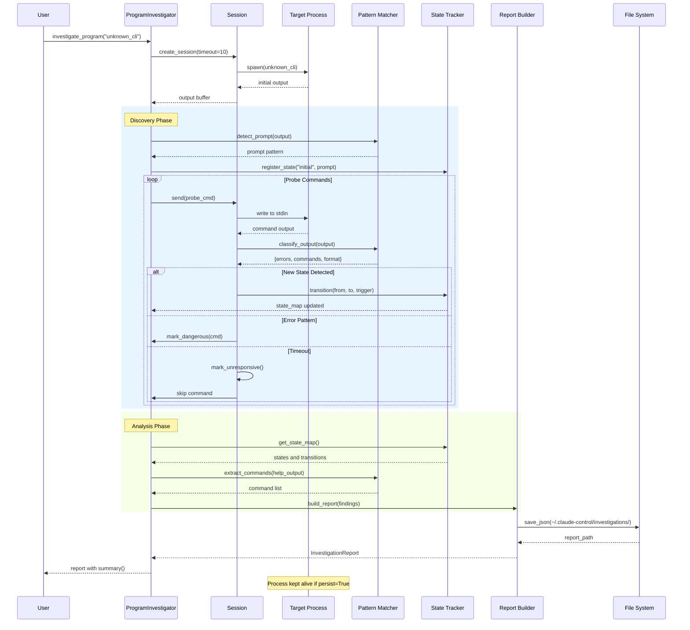

### Performance Notes
- Typical execution: 5-60 seconds depending on program complexity
- Bottleneck: Waiting for program responses (timeout critical)
- Optimization: Parallel probing when safe

### Failure Modes
- Program doesn't start: ProcessError raised immediately
- No prompt detected: Falls back to send-only mode
- Hangs on input: Timeout protection (default 10s)
- Dangerous operations: Safe mode blocks execution

---

## 2. Session Reuse and Registry Management
**Trigger:** Multiple calls to `control("server", reuse=True)`
**Outcome:** Efficient session reuse across script runs

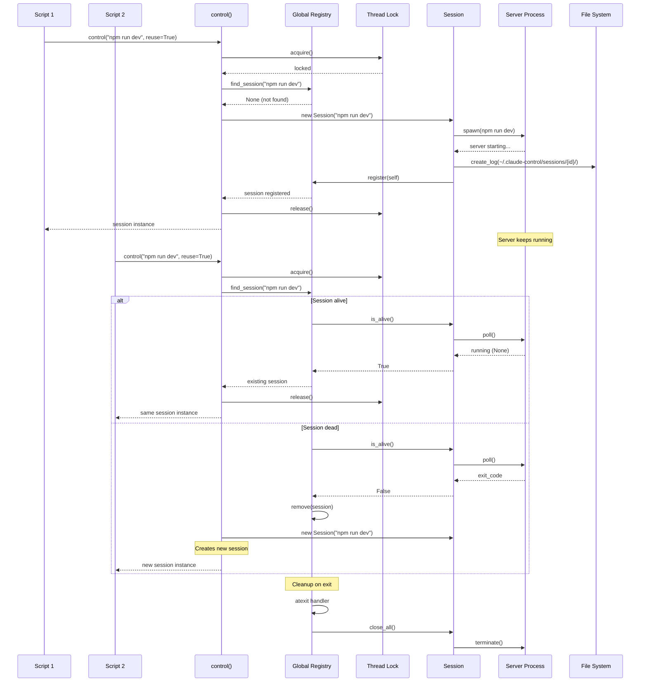

### Performance Notes
- Registry lookup: O(n) with typically <20 sessions
- Lock contention: Minimal, held briefly
- Session creation: ~10-100ms overhead

### Failure Modes
- Registry corruption: Rebuilt on next access
- Zombie sessions: Cleaned by psutil check
- Lock deadlock: Timeout protection (30s)

### Concurrency
- Thread-safe via global lock
- One writer at a time for registry
- Sessions themselves not thread-safe

---

## 3. Black Box Testing Flow
**Trigger:** `black_box_test("app", timeout=10)`
**Outcome:** Comprehensive test report with pass/fail for multiple test categories

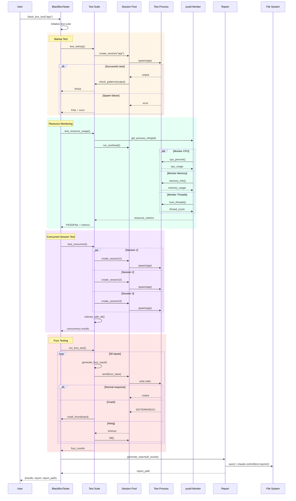

### Performance Notes
- Full test suite: 10-120 seconds
- Parallel tests: Limited by system resources
- Fuzz testing: Configurable iterations (default 50)

### Failure Modes
- Test process crash: Caught and reported
- Resource exhaustion: Killed with report
- Infinite loops: Timeout protection
- System limits: Graceful degradation

---

## 4. Command Chain Execution
**Trigger:** CommandChain with conditional execution
**Outcome:** Sequential execution with condition-based flow control

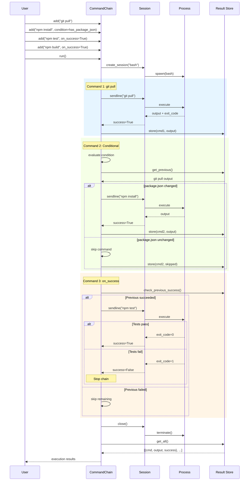

### Performance Notes
- Sequential execution: No parallelization
- Condition evaluation: <1ms overhead
- State preserved between commands

### Failure Modes
- Command failure: Stops chain if on_success=True
- Condition error: Treated as False, command skipped
- Session death: Chain aborts with error

---

## 5. Pattern Detection and State Transition
**Trigger:** Output from CLI program triggers state change
**Outcome:** Accurate state tracking and pattern extraction

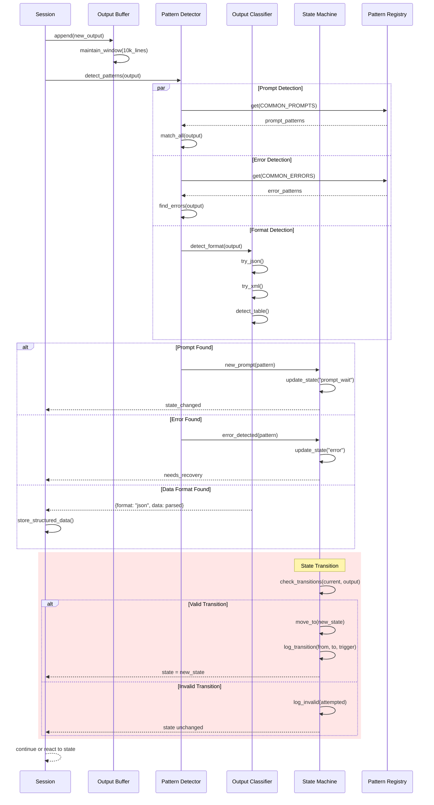

### Performance Notes
- Pattern matching: ~1ms per 100 lines
- JSON parsing: Cached if unchanged
- State transitions: O(1) lookup

### Failure Modes
- Ambiguous patterns: First match wins
- Malformed data: Logged, processing continues
- State loops: Detected and broken

---

## 6. Parallel Command Execution
**Trigger:** `parallel_commands(["cmd1", "cmd2", "cmd3"])`
**Outcome:** Concurrent execution with result aggregation

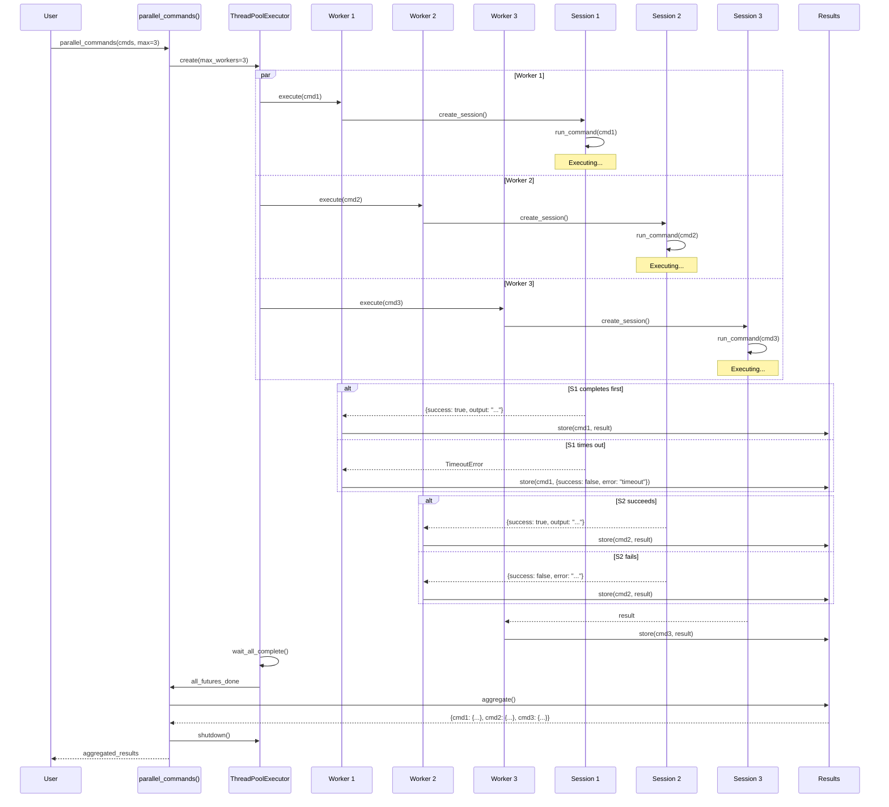

### Performance Notes
- Parallel speedup: Limited by slowest command
- Thread pool overhead: ~1ms per worker
- Max concurrent: System dependent (default 10)

### Failure Modes
- Worker crash: Caught, error in result
- Resource exhaustion: Queued execution
- Deadlock: Timeout on all operations

### Concurrency
- Thread-safe result aggregation
- Independent sessions per worker
- No shared state between commands

---

## 7. Session Recording with Tape Generation
**Trigger:** Session with `record=RecordMode.NEW`
**Outcome:** Recorded tape file for deterministic replay

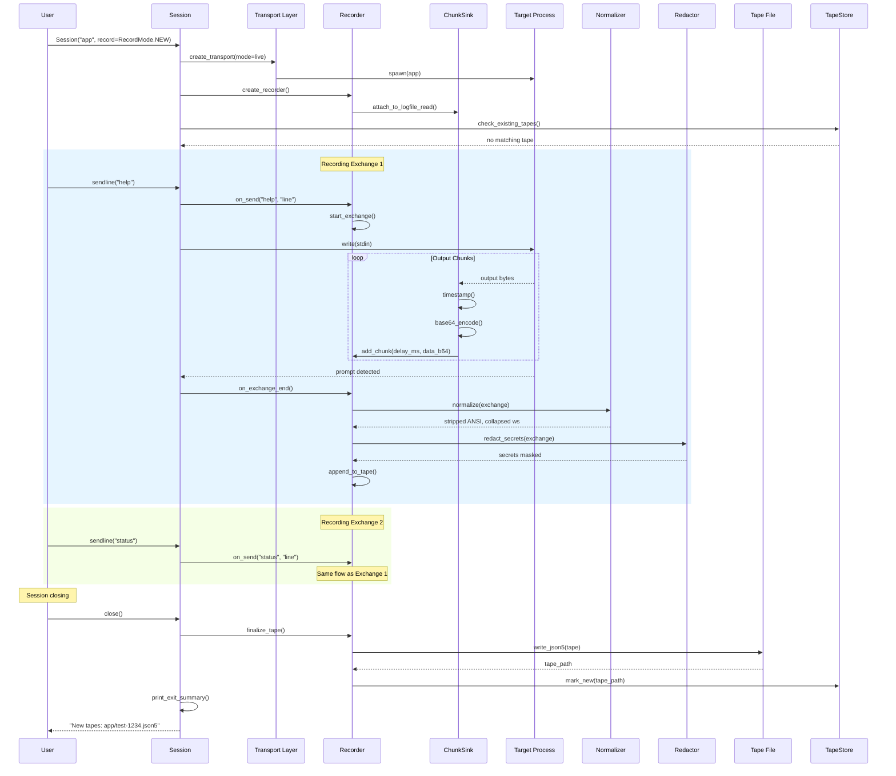

### Performance Notes
- Recording overhead: <5% with ChunkSink via logfile_read
- Chunk capture: Real-time with minimal buffering
- Tape write: Atomic via temp file + rename
- JSON5 serialization: ~10ms for typical session

### Failure Modes
- Disk full: Continue session without recording
- Secret detected: Redact or abort based on config
- Write permission denied: Log warning, continue live
- Malformed exchange: Skip exchange, log error

## 8. Tape Replay with Fallback
**Trigger:** Session with `record=RecordMode.DISABLED, fallback=FallbackMode.PROXY`
**Outcome:** Deterministic replay or live execution fallback

```mermaid
sequenceDiagram
    participant User
    participant Session
    participant Transport as Transport Layer
    participant Store as TapeStore
    participant Index as TapeIndex
    participant Player as ReplayTransport
    participant Matcher
    participant Process as Live Process
    participant Output as Output Buffer

    User->>Session: Session("app", record=DISABLED, fallback=PROXY)
    Session->>Store: load_all_tapes()
    Store->>Index: build_index(normalizer)
    Index-->>Session: index ready
    Session->>Transport: create_transport(mode=replay)
    Transport->>Player: ReplayTransport(store, index)

    rect rgb(230, 245, 255)
        Note over Player: Replay Hit
        User->>Session: sendline("help")
        Session->>Player: send("help\\n")
        Player->>Matcher: build_match_key(input)
        Matcher->>Matcher: normalize(input)
        Matcher-->>Player: key
        Player->>Index: lookup(key)
        Index-->>Player: tape[0].exchange[0]

        Player->>Player: stream_chunks()
        loop Output Chunks
            Player->>Player: apply_latency(chunk.delay_ms)
            Player->>Output: append(base64_decode(chunk))
            Output-->>Session: output available
        end

        Session->>Session: expect(">>>")
        Session-->>User: matched, output returned
    end

    rect rgb(255, 245, 230)
        Note over Player: Replay Miss → Fallback
        User->>Session: sendline("unknown_cmd")
        Session->>Player: send("unknown_cmd\\n")
        Player->>Index: lookup(key)
        Index-->>Player: None (miss)

        alt Fallback = PROXY
            Player->>Transport: switch_to_live()
            Transport->>Process: spawn(app)
            Transport->>Process: send("unknown_cmd\\n")
            Process-->>Transport: live output
            Transport-->>Session: output

            alt Record = NEW
                Transport->>Recorder: record_exchange()
                Note over Recorder: Records for future
            end
        else Fallback = NOT_FOUND
            Player-->>Session: TapeMissError
            Session-->>User: Error: No tape found
        end
    end

    Session->>Store: get_usage_stats()
    Store-->>Session: {new: [], unused: ["old.json5"]}
    Session-->>User: Exit summary
```

### Performance Notes
- Tape loading: All tapes loaded at startup (~200ms per 1000 exchanges)
- Index lookup: O(1) with hash map (~2ms per match)
- Chunk streaming: Background thread for non-blocking output
- Fallback switch: ~10-100ms to spawn live process

### Failure Modes
- Tape not found: Apply fallback mode (PROXY or NOT_FOUND)
- Invalid tape format: Skip tape, log error, try next
- Chunk corruption: Skip chunk, continue stream
- Index collision: Use first match, log warning

## 9. Real-time Stream Processing

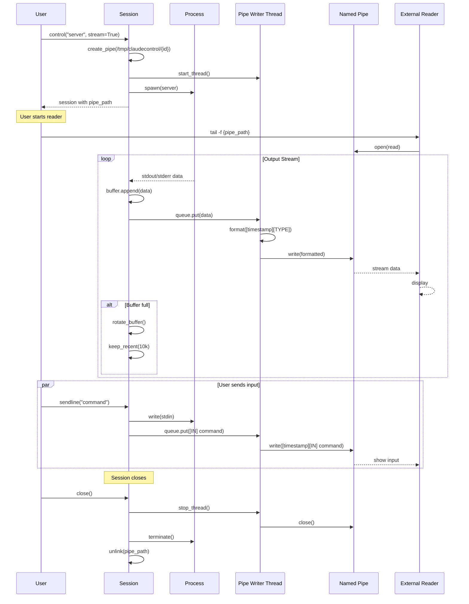

### Performance Notes
- Stream latency: <1ms typically
- Buffer size: 64KB OS pipe buffer
- No persistence: Real-time only

### Failure Modes
- Reader disconnects: Writer continues
- Pipe full: Blocks writer (rare)
- No reader: Data discarded

---

## 10. Error Injection and Testing
**Trigger:** Replay with `error_rate` configured
**Outcome:** Controlled error injection for resilience testing

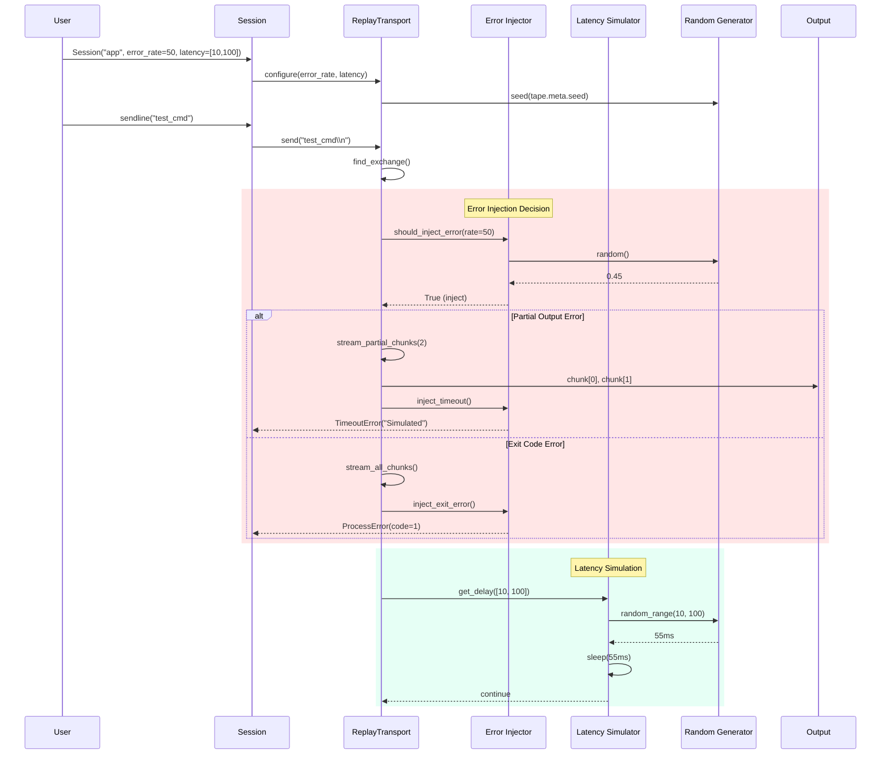

### Performance Notes
- Error injection: Deterministic with seeded RNG
- Latency simulation: Accurate to ~1ms resolution
- Partial output: Controllable chunk count
- Testing throughput: Same as normal replay

### Failure Modes
- Invalid error_rate: Clamp to 0-100 range
- Latency overflow: Cap at reasonable maximum (30s)
- RNG seed missing: Use default seed for reproducibility

## 11. Tape Management and Validation
**Trigger:** `ccontrol tapes validate`
**Outcome:** Tape integrity check and cleanup

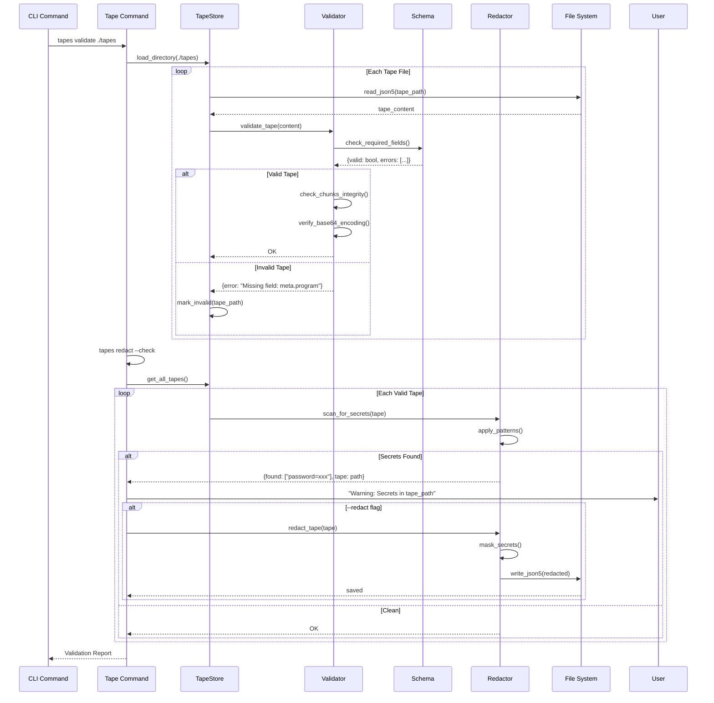

### Performance Notes
- Validation: ~5ms per tape with schema check
- Secret scanning: Regex-based, ~10ms per tape
- Batch operations: Process all tapes in single pass
- JSON5 parsing: Handled by pyjson5 with Cython optimization

### Failure Modes
- Malformed JSON5: Report error, skip tape
- Schema version mismatch: Attempt migration or skip
- Redaction failure: Keep original, log error
- File lock timeout: Skip locked tape, continue

## 12. Decorator and Matcher Pipeline
**Trigger:** Complex matching with decorators
**Outcome:** Transformed and matched exchanges

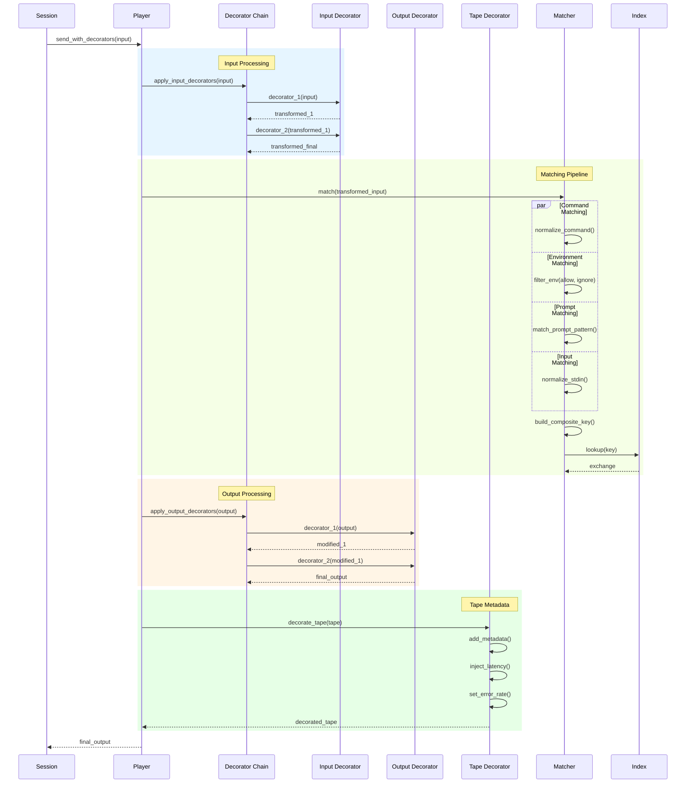

### Performance Notes
- Decorator chain: <1ms overhead per decorator
- Parallel matching: All matchers run concurrently
- Key generation: Normalized and cached
- Index lookup: O(1) average case

### Failure Modes
- Decorator exception: Continue with original data
- Matcher conflict: First match wins
- Missing required field: Fail match, try next
- Circular decorator: Detect and break loop

## Summary of Complex Interactions

These sequence diagrams illustrate ClaudeControl's most complex flows:

1. **Investigation** - Multi-phase discovery with state tracking
2. **Session Reuse** - Thread-safe registry with lifecycle management
3. **Black Box Testing** - Parallel test execution with monitoring
4. **Command Chains** - Conditional sequential execution
5. **Pattern Detection** - Real-time classification and state management
6. **Parallel Execution** - Concurrent command processing
7. **Session Recording** - Tape generation with chunk capture and redaction
8. **Tape Replay** - Deterministic replay with fallback modes
9. **Stream Processing** - Real-time output streaming via named pipes
10. **Error Injection** - Controlled failure simulation for testing
11. **Tape Management** - Validation, redaction, and maintenance
12. **Decorator Pipeline** - Multi-stage transformation and matching

Each flow demonstrates:
- Multiple component coordination (3+ actors)
- Asynchronous or parallel operations
- Complex error handling and recovery
- Critical timing and ordering constraints
- Record & replay integration with existing features

The diagrams focus on the non-obvious interactions that make ClaudeControl powerful yet reliable for CLI automation, testing, discovery, and deterministic replay. The record & replay system seamlessly integrates with all existing capabilities while adding powerful testing and debugging features.