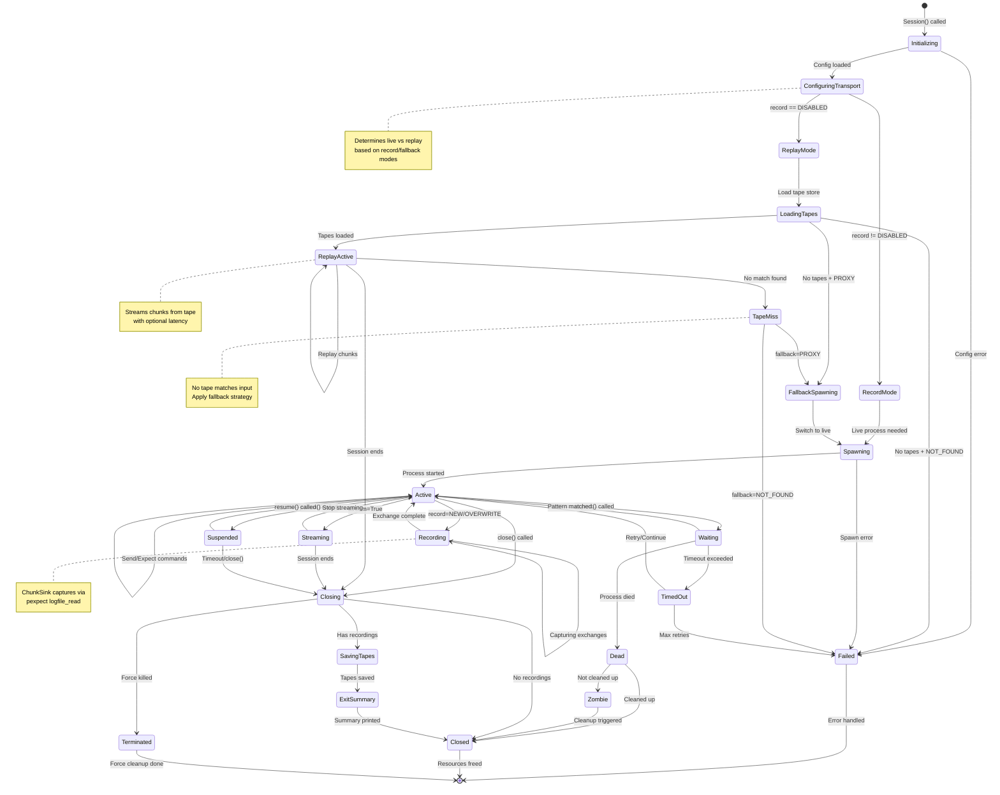
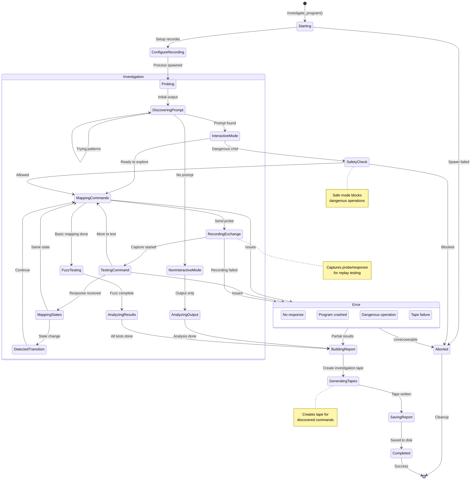
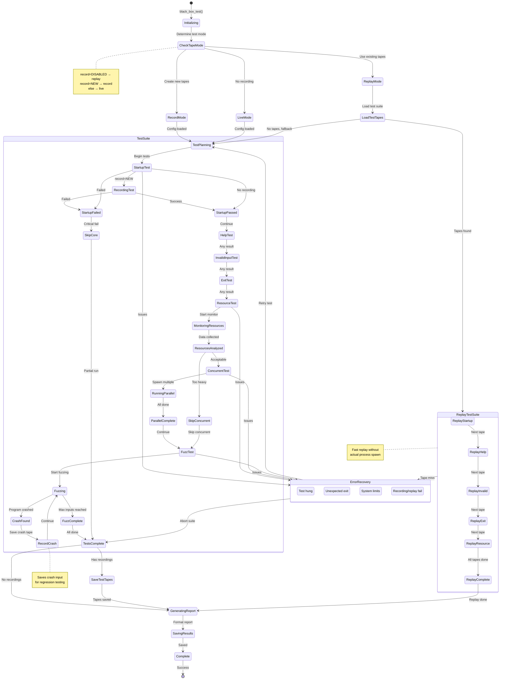
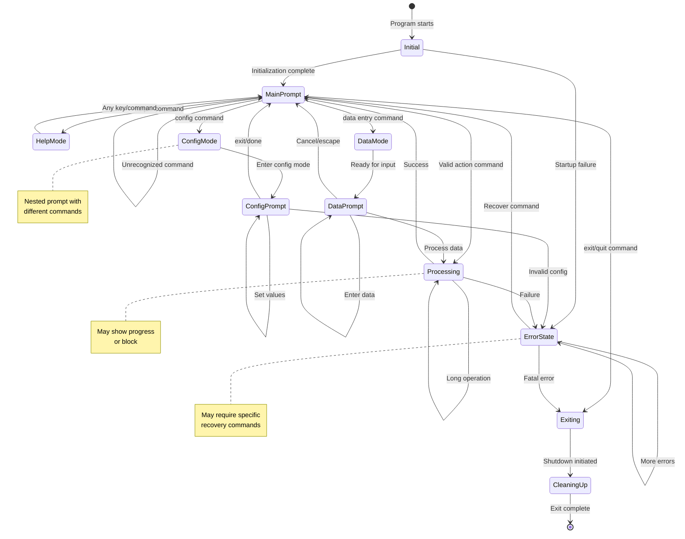
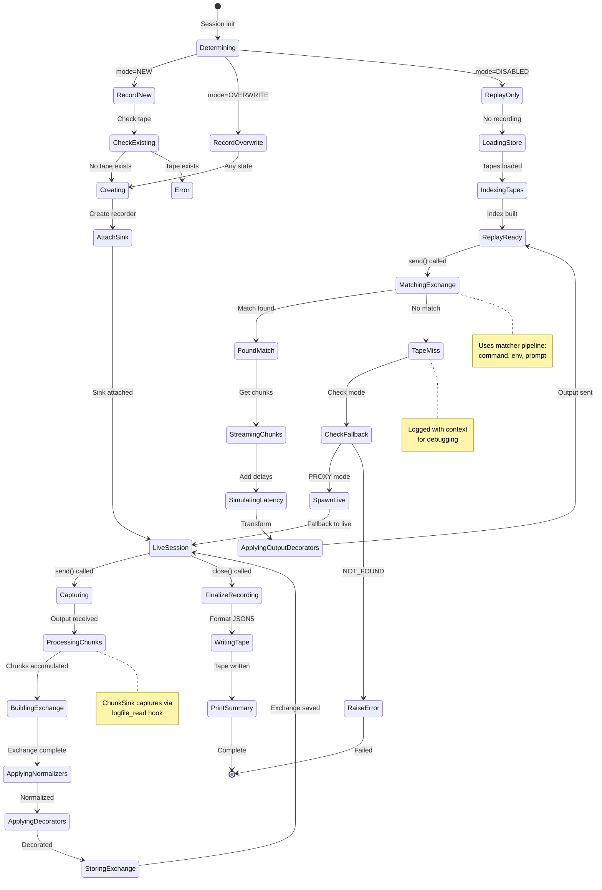

# ClaudeControl State Machine Diagrams

## 1. Session Lifecycle State Machine
**Context:** Manages the complete lifecycle of a CLI process control session
**State Storage:** In-memory (Session object) + file system logs (~/.claude-control/sessions/)

### States
- **Initializing**: Setting up session configuration and directories
- **ConfiguringTransport**: Determining live vs replay mode based on settings
- **RecordMode**: Session will record exchanges to tapes
- **ReplayMode**: Session will replay from existing tapes
- **LoadingTapes**: Loading all tapes from directory and building index
- **FallbackSpawning**: Switching to live process due to tape miss
- **Spawning**: Creating the subprocess with pexpect
- **Active**: Process running and responsive to commands
- **Recording**: Actively capturing exchange data via ChunkSink
- **ReplayActive**: Replaying chunks from tape instead of live process
- **TapeMiss**: No tape found matching current input
- **Waiting**: Blocked on expect() waiting for pattern
- **TimedOut**: Pattern not found within timeout period
- **Streaming**: Actively streaming output to named pipe
- **Suspended**: Process paused but not terminated
- **Dead**: Process has exited but session exists
- **Zombie**: Dead process not yet cleaned up
- **Closing**: Graceful shutdown in progress
- **SavingTapes**: Writing recorded exchanges to tape files
- **ExitSummary**: Printing tape usage summary
- **Closed**: All resources freed, session complete
- **Failed**: Unrecoverable error occurred
- **Terminated**: Force-killed due to timeout or error

### Transition Guards
- `ConfiguringTransport → RecordMode`: record != RecordMode.DISABLED
- `ConfiguringTransport → ReplayMode`: record == RecordMode.DISABLED
- `LoadingTapes → ReplayActive`: Matching tapes found
- `LoadingTapes → FallbackSpawning`: No tapes && fallback == PROXY
- `LoadingTapes → Failed`: No tapes && fallback == NOT_FOUND
- `Active → Recording`: record == NEW or OVERWRITE
- `ReplayActive → TapeMiss`: No exchange matches input
- `TapeMiss → FallbackSpawning`: fallback == FallbackMode.PROXY
- `TapeMiss → Failed`: fallback == FallbackMode.NOT_FOUND
- `Spawning → Active`: Process PID exists and responding
- `Active → Waiting`: Valid pattern provided to expect()
- `Waiting → TimedOut`: Time > timeout value
- `Active → Streaming`: Named pipe successfully created
- `Dead → Zombie`: auto_cleanup = False
- `Zombie → Closed`: Cleanup interval reached
- `Closing → SavingTapes`: Recorder has exchanges to save

### Transition Actions
- `Initializing → ConfiguringTransport`: Load record/replay config
- `ConfiguringTransport → RecordMode`: Create Recorder, attach ChunkSink
- `ConfiguringTransport → ReplayMode`: Create TapeStore, load all tapes
- `LoadingTapes → ReplayActive`: Build tape index, create ReplayTransport
- `RecordMode → Spawning`: Initialize recorder with live transport
- `FallbackSpawning → Spawning`: Log fallback reason, switch transport
- `Initializing → Spawning`: Create session directory, initialize buffers
- `Spawning → Active`: Register in global registry, start logging
- `Active → Recording`: Start new exchange, capture input
- `Recording → Active`: Finalize exchange, apply decorators
- `ReplayActive → TapeMiss`: Log miss details with context
- `Active → Waiting`: Set timeout timer, monitor output buffer
- `Waiting → TimedOut`: Capture recent output for error message
- `Active → Streaming`: Create named pipe, start writer thread
- `* → Dead`: Log exit status, capture final output
- `Dead → Zombie`: Mark for cleanup, notify registry
- `Closing → SavingTapes`: Write tape files, apply redaction
- `SavingTapes → ExitSummary`: Generate new/unused tape lists
- `ExitSummary → Closed`: Print summary to stdout
- `Closing → Closed`: Flush logs, remove from registry, delete pipe
- `* → Failed`: Log error, attempt resource cleanup

### Timeout Behaviors
- **Waiting state**: Configurable timeout (default 30s)
- **Suspended state**: Session timeout (default 300s)
- **Zombie state**: Cleanup interval (60s)

### Concurrency Control
- Thread-safe state transitions via session lock
- Registry lock for state changes affecting global registry
- Atomic state updates with logging

---

## 2. Program Investigation State Machine
**Context:** Tracks investigation progress when discovering unknown CLI programs
**State Storage:** InvestigationReport object + JSON file persistence + Tape recording

### States
- **Starting**: Initializing investigation framework
- **ConfigureRecording**: Setting up tape recorder if enabled
- **Probing**: Sending initial commands to understand program
- **DiscoveringPrompt**: Detecting interactive prompt patterns
- **InteractiveMode**: Program is interactive, can send commands
- **NonInteractiveMode**: Program is output-only or batch mode
- **MappingCommands**: Discovering available commands
- **RecordingExchange**: Starting tape exchange for command probe
- **TestingCommand**: Executing a specific probe command
- **MappingStates**: Building state transition map
- **DetectedTransition**: Found state change trigger
- **FuzzTesting**: Sending random inputs for edge cases
- **AnalyzingResults**: Processing all gathered data
- **BuildingReport**: Creating structured report
- **GeneratingTapes**: Creating tape files from investigation
- **SavingReport**: Writing to file system
- **SafetyCheck**: Evaluating command safety
- **Completed**: Investigation successful
- **Aborted**: Investigation failed or stopped

### Transition Guards
- `Starting → ConfigureRecording`: record_mode != DISABLED
- `DiscoveringPrompt → InteractiveMode`: Prompt pattern matched
- `DiscoveringPrompt → NonInteractiveMode`: Timeout without prompt
- `MappingCommands → RecordingExchange`: record_mode == NEW or OVERWRITE
- `MappingCommands → TestingCommand`: record_mode == DISABLED
- `MappingCommands → FuzzTesting`: Min commands discovered (5+)
- `SafetyCheck → Aborted`: Command matches danger patterns
- `Error → BuildingReport`: Partial results available
- `BuildingReport → GeneratingTapes`: Has exchanges to save

### Transition Actions
- `Starting → ConfigureRecording`: Create Recorder with investigation prefix
- `ConfigureRecording → Probing`: Attach ChunkSink to session
- `Starting → Probing`: Spawn target process, initialize report
- `DiscoveringPrompt → InteractiveMode`: Store prompt pattern
- `MappingCommands → RecordingExchange`: Start new exchange capture
- `RecordingExchange → TestingCommand`: Capture input command
- `TestingCommand → MappingStates`: Log command-response pair, finalize exchange
- `DetectedTransition → MappingCommands`: Update state graph
- `FuzzTesting → AnalyzingResults`: Classify fuzz findings
- `BuildingReport → GeneratingTapes`: Write investigation_[program].tape
- `GeneratingTapes → SavingReport`: Add tape reference to report
- `BuildingReport → SavingReport`: Generate JSON, create summary
- `SafetyCheck → Aborted`: Log blocked command, cleanup

---

## 3. Black Box Test Execution State Machine
**Context:** Manages the lifecycle of a comprehensive black box test suite
**State Storage:** BlackBoxTester object + test report JSON + Test tapes for replay

### States
- **Initializing**: Setting up test framework
- **CheckTapeMode**: Determining record/replay/live mode
- **ReplayMode**: Will replay from existing test tapes
- **RecordMode**: Will record new test tapes
- **LiveMode**: Will run tests without recording
- **LoadTestTapes**: Loading existing test suite tapes
- **TestPlanning**: Determining which tests to run
- **StartupTest**: Testing if program starts correctly
- **RecordingTest**: Capturing test exchange to tape
- **HelpTest**: Discovering help system
- **InvalidInputTest**: Testing error handling
- **ExitTest**: Testing shutdown behavior
- **ResourceTest**: Monitoring resource usage
- **MonitoringResources**: Active resource collection
- **ConcurrentTest**: Testing multiple instances
- **RunningParallel**: Multiple sessions active
- **FuzzTest**: Random input testing
- **Fuzzing**: Active fuzz testing
- **RecordCrash**: Saving crash-inducing input
- **ReplayTestSuite**: Replaying test sequence from tapes
- **TestsComplete**: All tests finished
- **SaveTestTapes**: Writing test recordings to disk
- **GeneratingReport**: Creating test report
- **Complete**: Test suite done

### Transition Guards
- `CheckTapeMode → ReplayMode`: record_mode == DISABLED && tapes exist
- `CheckTapeMode → RecordMode`: record_mode == NEW or OVERWRITE
- `CheckTapeMode → LiveMode`: record_mode == DISABLED && no tapes
- `LoadTestTapes → TestPlanning`: No matching tapes && fallback == PROXY
- `StartupTest → RecordingTest`: record_mode != DISABLED
- `StartupFailed → SkipCore`: Exit code != 0 or no output
- `ResourcesAnalyzed → SkipConcurrent`: Memory > 500MB or CPU > 80%
- `Fuzzing → FuzzComplete`: Input count >= max_inputs
- `CrashFound → RecordCrash`: record_mode != DISABLED
- `TestsComplete → SaveTestTapes`: Has recorded exchanges
- `ErrorRecovery → TestPlanning`: Retry count < 3

### Transition Actions
- `Initializing → CheckTapeMode`: Read record/fallback config
- `ReplayMode → LoadTestTapes`: Create TapeStore, load test_*.tape
- `RecordMode → TestPlanning`: Create Recorder with test prefix
- `LoadTestTapes → ReplayTestSuite`: Build replay transport
- `StartupTest → RecordingTest`: Start exchange capture
- `RecordingTest → StartupPassed`: Finalize exchange, log time
- `StartupTest → StartupPassed`: Log startup time, initial output
- `ResourceTest → MonitoringResources`: Start psutil monitoring
- `ConcurrentTest → RunningParallel`: Spawn N sessions
- `FuzzTest → Fuzzing`: Generate random inputs
- `CrashFound → RecordCrash`: Create crash_[timestamp].tape
- `RecordCrash → Fuzzing`: Restart process, continue
- `TestsComplete → SaveTestTapes`: Write test suite tapes
- `SaveTestTapes → GeneratingReport`: Log tape statistics
- `TestsComplete → GeneratingReport`: Aggregate all test results
- `GeneratingReport → SavingResults`: Write JSON report

---

## 4. CLI Program State Machine (Discovered)
**Context:** Represents the discovered state model of an investigated CLI program
**State Storage:** ProgramState objects within InvestigationReport

### States (Discovered Program)
- **Initial**: Program starting up
- **MainPrompt**: Primary command prompt
- **HelpMode**: Displaying help information
- **ConfigMode**: Configuration submenu
- **ConfigPrompt**: Nested config prompt
- **DataMode**: Data entry mode
- **DataPrompt**: Waiting for data input
- **Processing**: Executing command
- **ErrorState**: Error condition active
- **Exiting**: Shutdown in progress
- **CleaningUp**: Final cleanup

### Discovered Transitions
- `MainPrompt → HelpMode`: Commands: "help", "?", "h"
- `MainPrompt → ConfigMode`: Commands: "config", "setup", "set"
- `MainPrompt → DataMode`: Commands: "add", "insert", "data"
- `MainPrompt → Processing`: Any valid action command
- `ConfigPrompt → MainPrompt`: Commands: "exit", "done", "back"
- `ErrorState → MainPrompt`: Commands: "reset", "clear", "recover"

### Observed Behaviors
- **Prompt Changes**: Different prompts indicate state
- **Command Availability**: Some commands only work in specific states
- **State Persistence**: Some states maintain context
- **Timeout Behaviors**: Some states auto-return to main

---

## 5. Record & Replay State Machine
**Context:** Manages the recording and replay of CLI sessions
**State Storage:** Recorder/ReplayTransport + Tape files (JSON5)

### States
- **Determining**: Evaluating record/replay mode from config
- **RecordNew**: Will create new tape, fail if exists
- **RecordOverwrite**: Will replace existing tape
- **ReplayOnly**: Will replay from tapes only
- **CheckExisting**: Verifying tape doesn't exist
- **Creating**: Setting up recording infrastructure
- **AttachSink**: Attaching ChunkSink to pexpect
- **LiveSession**: Active session with live process
- **Capturing**: Recording input command
- **ProcessingChunks**: Collecting output chunks
- **BuildingExchange**: Assembling input/output exchange
- **ApplyingNormalizers**: Stripping ANSI, collapsing whitespace
- **ApplyingDecorators**: Running input/output transformers
- **StoringExchange**: Saving to recorder buffer
- **FinalizeRecording**: Completing recording session
- **WritingTape**: Serializing to JSON5 format
- **PrintSummary**: Displaying tape statistics
- **LoadingStore**: Loading tape files from directory
- **IndexingTapes**: Building matcher indices
- **ReplayReady**: Ready to replay exchanges
- **MatchingExchange**: Finding tape for input
- **FoundMatch**: Tape exchange located
- **StreamingChunks**: Outputting recorded chunks
- **SimulatingLatency**: Adding realistic delays
- **ApplyingOutputDecorators**: Transforming replay output
- **TapeMiss**: No matching tape found
- **CheckFallback**: Evaluating fallback strategy
- **SpawnLive**: Creating live process as fallback
- **RaiseError**: Failing with TapeMissError

### Transition Guards
- `Determining → RecordNew`: record_mode == RecordMode.NEW
- `Determining → RecordOverwrite`: record_mode == RecordMode.OVERWRITE
- `Determining → ReplayOnly`: record_mode == RecordMode.DISABLED
- `CheckExisting → Error`: os.path.exists(tape_path)
- `MatchingExchange → TapeMiss`: No matcher returns True
- `CheckFallback → SpawnLive`: fallback_mode == FallbackMode.PROXY
- `CheckFallback → RaiseError`: fallback_mode == FallbackMode.NOT_FOUND

### Transition Actions
- `Creating → AttachSink`: Create ChunkSink, set as logfile_read
- `Capturing → ProcessingChunks`: Store input, start chunk collection
- `BuildingExchange → ApplyingNormalizers`: Run ANSI strip, whitespace collapse
- `ApplyingDecorators → StoringExchange`: Apply redaction, add to buffer
- `FinalizeRecording → WritingTape`: Serialize with json5.dumps
- `WritingTape → PrintSummary`: Print new/unused tape lists
- `LoadingStore → IndexingTapes`: Parse JSON5, build command index
- `MatchingExchange → FoundMatch`: Run matcher pipeline
- `StreamingChunks → SimulatingLatency`: Sleep for chunk.delay_ms
- `TapeMiss → CheckFallback`: Log miss with input context
- `SpawnLive → LiveSession`: Create LiveTransport, spawn process

---

## Summary

These state machines document ClaudeControl's most complex state management:

1. **Session Lifecycle** - 20+ states managing process control from spawn to cleanup, with record/replay integration
2. **Program Investigation** - 18+ states for systematic program discovery with tape generation
3. **Black Box Test Execution** - 24+ states for comprehensive test orchestration with replay capability
4. **Discovered CLI Program** - Generic model of investigated program states
5. **Record & Replay** - 27 states managing tape recording and replay with fallback strategies

Each state machine shows:
- Non-linear, complex transitions with multiple paths
- Guards and conditions controlling transitions
- Actions triggered by state changes
- Error states and recovery mechanisms
- Concurrent and nested state handling
- Record/replay mode integration throughout

These models are essential for understanding:
- How sessions manage process lifecycle and recovery
- How investigations systematically discover program behavior
- How testing proceeds through comprehensive test suites
- How discovered programs typically organize their states
- How recording captures exchanges non-intrusively
- How replay provides deterministic session reproduction
- How fallback modes ensure reliability in CI/CD

The state machines reveal the sophisticated control flow that enables ClaudeControl to reliably manage CLI processes across all three core capabilities: Discover, Test, and Automate, now enhanced with comprehensive Record & Replay functionality for deterministic testing and demonstration.